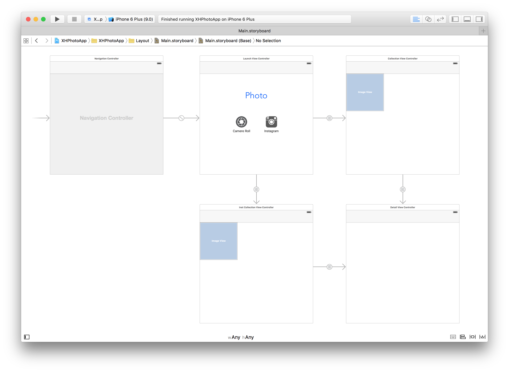

###XHPhotoApp
---
####Demo
This app is a demo for users to view images from camera roll and Instagram.  

  

####Keynote Slides
App Overview: [https://www.dropbox.com/s/rl5d93ypmn2wocy/app_overview.pdf?dl=0](https://www.dropbox.com/s/rl5d93ypmn2wocy/app_overview.pdf?dl=0)   
Expansion Idea: [https://www.dropbox.com/s/l18puz2xytoms6x/idea_expansion.pdf?dl=0](https://www.dropbox.com/s/l18puz2xytoms6x/idea_expansion.pdf?dl=0)

####Implementation

**XHPhotoLibrary** is a self witten library to interact with photos in the device library using iOS Photo Framework. It contains these methos:  

```Objective-C  
// load camera roll photos using blokcs to handle successful or unauthorized situation
- (void)loadCameraRollWithSuccess:(void(^)(void))successBlock
                     Unauthorized:(void(^)(void))unauthorizedBlock;

// load thunbnail at one collectionview index
- (void)thumbAtIndex:(NSInteger)index thumbSize:(CGSize)thumbSize completionHandler:(void(^)(UIImage *thumb))completionHandler;

// load full resolution image at one collectionview index
- (void)imageAtIndex:(NSInteger)index completionHandler:(void(^)(UIImage *image))completionHandler;

// reset image cache manager
- (void) resetCache;

// update image cache image with a new range
- (void) updateCacheStartWith:(NSMutableArray *)addedIndexPaths stopWith:(NSMutableArray *)removedIndexPaths inSize:(CGSize)size;

// return the number of images in the library
- (NSInteger)imageCount;  
```  
**UI part** *UICollectionViewController* is used to contain thumbnails of photos. *UIScrollView* with a *UIImage* subview is used to show selected image details. With *UIScrollView*, the demo suports zooming in and zooming out images. Autolayout is used in the demo. Below is the storyboard of demo: 

  

**Network** In order to access to Instagram, the 3rd party library *[SimpleAuth](http://simpleauth.io/)* is used in the app to complete the OAuth2 step. *SimpleAuth* is installed using *CocoaPods*, so there is a *Podfile* and another *workspace* created by *CocoaPods* in the project directory.

**PS.** Instagram part is not using the self written library. I temporarily had some problem adding the instagram part to the library, but I'll try to figure this out. The demo is really simple and lots of features could be much better , I'll keep thinking about this and update it.